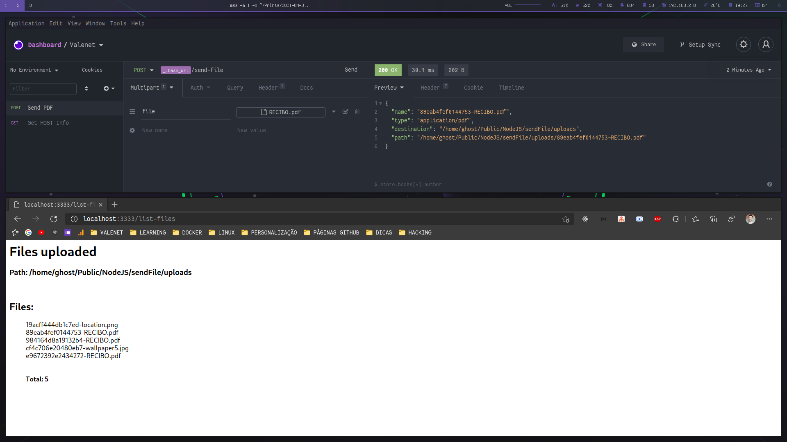

## 🚀 Technologies

This project was developed with the following technologies:

- [NodeJS](https://nodejs.org)

## 💻 Project

This simple project demonstrates how to send files using Multer in NodeJS

<p align="center">
  
</p>

## Getting Started

First, you need to install all project dependencies:

```bash
yarn install # OR npm install
```

Run the development server:

```bash
yarn dev # OR npm run dev
```

## Endpoints

> Send file: http://localhost:3333/send-file [Multipart/FormData]

> List files: http://localhost:3333/list-files [GET]

## :memo: License

This project is under the MIT license. See the file [LICENSE](LICENSE) for more details.

